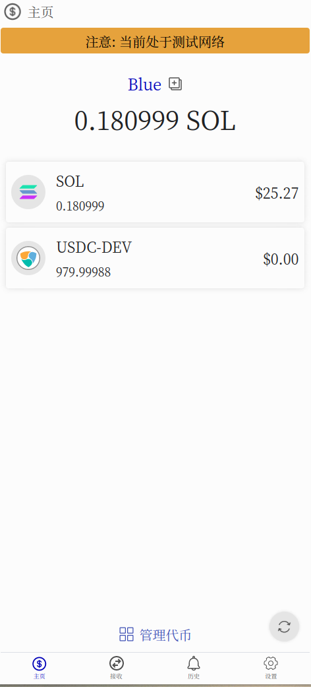
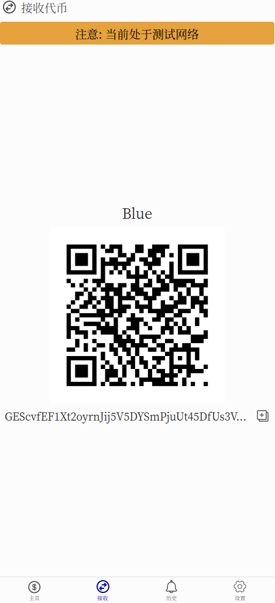
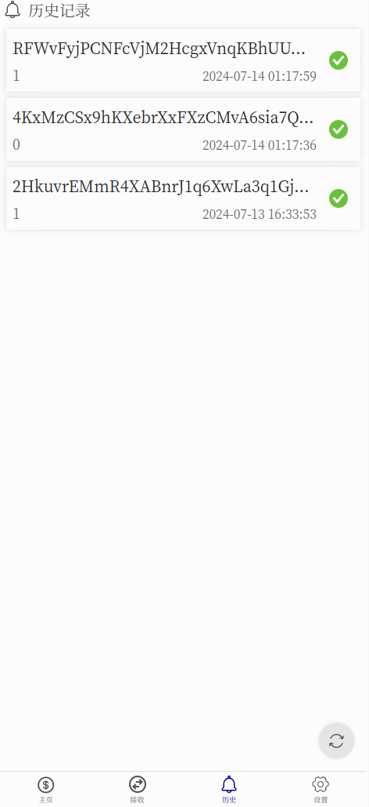
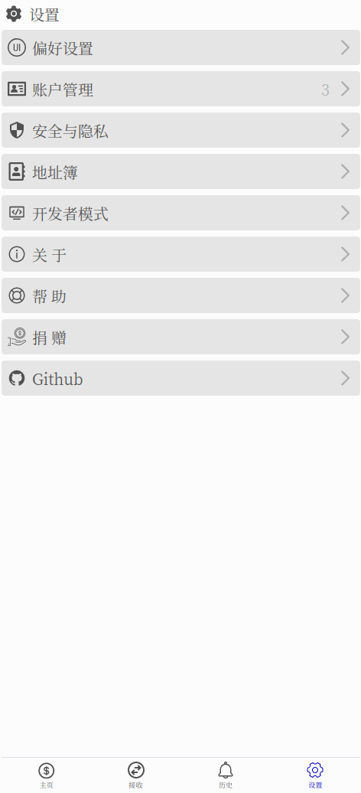
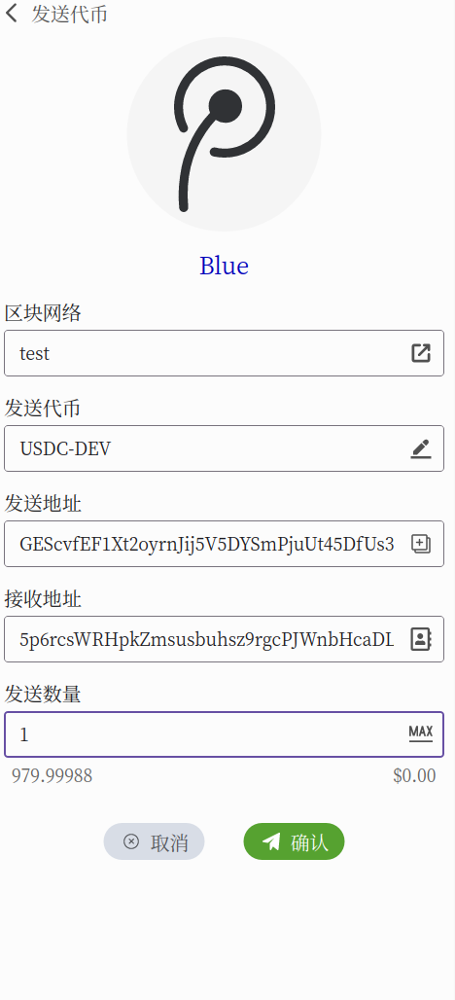
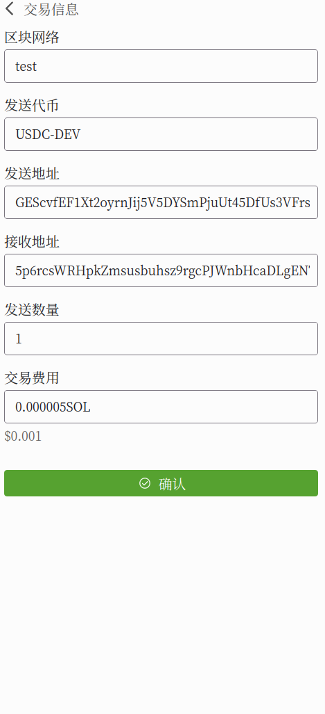
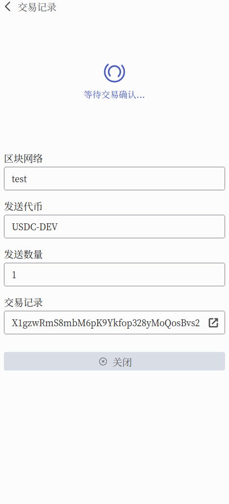
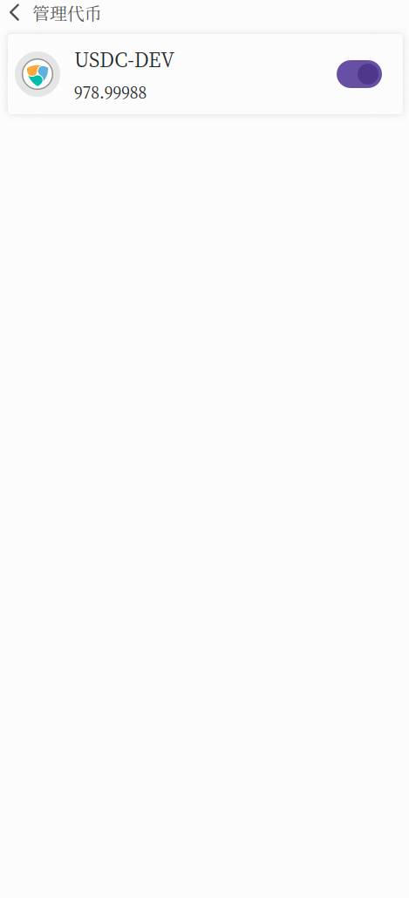

    
    
    
    
    
    
    
    

[中文文档](./README.zh-CN.md)

**If you can't review the source codes, I don't recommand you to use this wallet. If you use this wallet, you take your own risk.**

### Introduction
It's a `Solana` wallet. Based on Rust and Slint-ui. You can compile it for Linux, Windows and Android. However, There are some bad user experience on Android platform. This wallet uses different algorithm to generate `Seed` with `Phantom`. So the same mnemonic would generate different wallet address.

### Features
- [x] Create and recover account
- [x] Derive child accounts
- [x] Address book
- [x] Transaction history
- [x] Development mode of TestNet and DevNet
- [x] Send SOL and spl token in MainNet
- [x] Genarate QrCode for address
- [x] Support sending token with memo and setting prioritization fee

### TODO
- [ ] fetch spl token price
- [ ] copy and paste text on Android

### Android platform build information
- `min-sdk-version = 23`
- `target-sdk-version = 32`

#### How to build?
- Install `Rust` and `Cargo`
- Install Android `sdk`, `ndk`, `jdk17`, and set environment variables
- Run `make` to build a release version android APK
- Run `make debug` to run it on desktop platform
- Run `make build-desktop-release` to build a release version desktop APK
- Refer to [Makefile](./Makefile) for more information

### Reference
- [Slint Language Documentation](https://slint-ui.com/releases/1.0.0/docs/slint/)
- [github/slint-ui](https://github.com/slint-ui/slint)
- [Viewer for Slint](https://github.com/slint-ui/slint/tree/master/tools/viewer)
- [LSP (Language Server Protocol) Server for Slint](https://github.com/slint-ui/slint/tree/master/tools/lsp)
- [developer.android.com](https://developer.android.com/guide)
- [solana faucet](https://faucet.solana.com/)
- [solana explorer](https://explorer.solana.com/?cluster=testnet)
- [solana fm is a next generation explorer](https://solana.fm/)
- [solana cookbook](https://solanacookbook.com/#contributing)
- [spl token faucet](https://spl-token-faucet.com/?token-name=USDC-Dev)
- [How do we get test stablecoins on Solana like USDC or USDT?](https://solana.stackexchange.com/questions/1513/how-do-we-get-test-stablecoins-on-solana-like-usdc-or-usdt)
- [solana wiki](https://solana.wiki/)
- [solana docs](https://solana.com/docs)
- [examples](https://github.com/solana-developers/program-examples)
- [A Complete Guide to Solana Development for Ethereum Developers](https://solana.com/developers/evm-to-svm/complete-guide)
- [Solana Development Course](https://www.soldev.app/course)
- [developers.metaplex](https://developers.metaplex.com/token-metadata)
