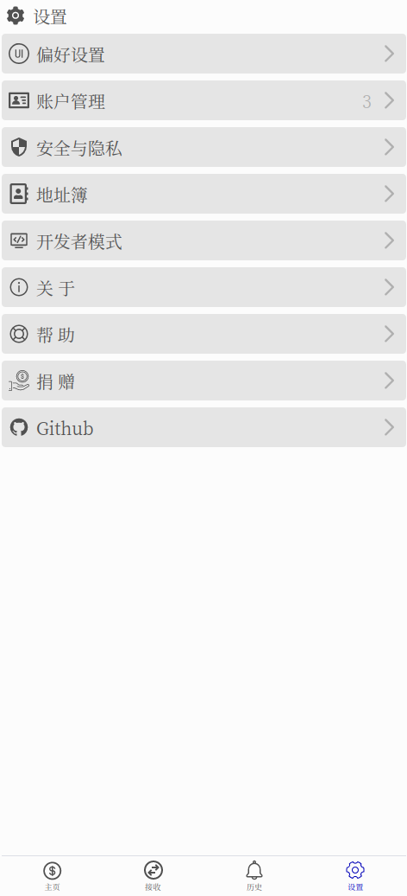

    
    
    
    
    
    
    

[English Documentation](./README.md)

#### 简介

#### 功能

##### 安卓平台编译信息
- `min-sdk-version = 23`
- `target-sdk-version = 32`

#### 如何构建?
- 安装 `Rust` 和 `Cargo`
- 安装 Android `sdk`, `ndk`, `jdk17`, 和设置对应的环境变量
- 运行 `make` 编译安卓平台程序
- 运行 `make debug` 编译桌面平台程序
- 参考 [Makefile](./Makefile) 了解更多信息

#### 参考
- [Slint Language Documentation](https://slint-ui.com/releases/1.0.0/docs/slint/)
- [github/slint-ui](https://github.com/slint-ui/slint)
- [Viewer for Slint](https://github.com/slint-ui/slint/tree/master/tools/viewer)
- [LSP (Language Server Protocol) Server for Slint](https://github.com/slint-ui/slint/tree/master/tools/lsp)
- [developer.android.com](https://developer.android.com/guide)
- [solana faucet](https://faucet.solana.com/)
- [solana explorer](https://explorer.solana.com/?cluster=testnet)
- [solana fm is a next generation explorer](https://solana.fm/)
- [solana cookbook](https://solanacookbook.com/#contributing)
- [spl token faucet](https://spl-token-faucet.com/?token-name=USDC-Dev)
- [How do we get test stablecoins on Solana like USDC or USDT?](https://solana.stackexchange.com/questions/1513/how-do-we-get-test-stablecoins-on-solana-like-usdc-or-usdt)
- [solana wiki](https://solana.wiki/)
- [solana docs](https://solana.com/docs)
- [examples](https://github.com/solana-developers/program-examples)
- [A Complete Guide to Solana Development for Ethereum Developers](https://solana.com/developers/evm-to-svm/complete-guide)
- [Solana Development Course](https://www.soldev.app/course)
